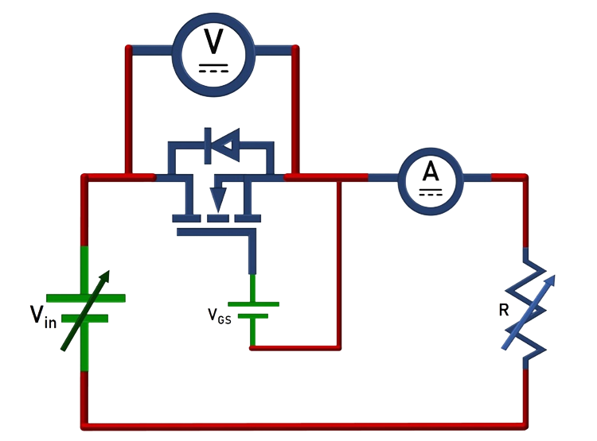
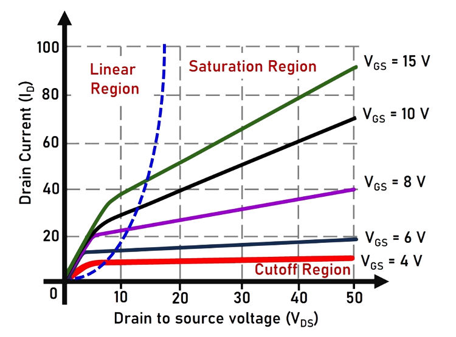
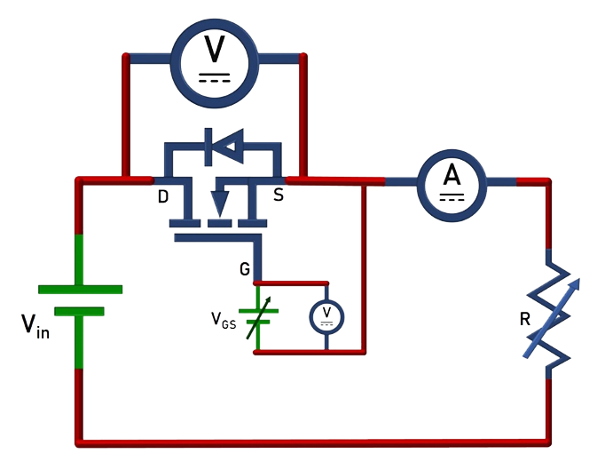

### Theory

**Representation of MOSFET:**

Fig. 1(a) and 1(b) show the symbolic representation of MOSFET and a typical MOSFET package available in market.

 

<table border="0" align="center" style="width:100%; border:none;">
  <tr>
<td style="width:50%">

 

  
Fig. 1(a). Symbolic representation of MOSFET
  

</td>
<td style="width:50%">
  

 

  
Fig. 1(b). A typical MOSFET package
  

 
    </td>
  </tr>
</table>
 

 

 
  
**Introduction to MOSFET:**

Fig. 2 shows the internal structure of MOSFET. Some of the key features of MOSFET are compiled and given below.

 
Fig. 2. Internal structure of MOSFET.
 

 

1.	It is a three-terminal majority carrier device. It exhibits high switching speed, low rise and fall time. It is suitable for low-power, high-frequency switching applications such as DC-DC converters. 

2.	It is a voltage-controlled device and the ‘Gate circuit’ requires only a small amount of current for it to start conducting (ON-State). 

3.	There are two types of MOSFETs: a) Depletion type, b) Enhancement type. Both have three terminals: Drain (D), Source (S) and Gate (G). 

4.  Enhancement-type MOSFET works in two modes: ON-state (conducting) and OFF-state (blocking), controlled by the PWM signal given to the Gate terminal. 

5.  For gate-to-source voltage more than threshold (VT), Enhancement-type MOSFET conducts. At zero gate voltage, it remains in OFF-state. Hence, it is generally used as switching device in  power converters/ power conversion applications. 	  

**Operating modes of MOSFET switching device:**
 

1.	Forward Blocking State (vDS > 0, vGS = 0): A MOSFET is a voltage controlled device. When Drain-to-Source voltage (vDS ) is positive, both the junctions remain reverse biased. MOSFET doesn’t conduct.

2.	Forward Conducting State (vDS > 0, vGS ≥ VT ): When Drain-to-Source voltage (vDS ) is positive, with Gate-to-Source voltage (vGS) more than threshold voltage, the MOSFET starts conducting and hence current flows from drain to source. 
During forward conduction, the MOSFET will operate in any one of the following states, depending on the values of drain-to-source voltage (VDS) and the Gate voltage (VGS) values: Cut-off region, linear region and Saturation region.1
  
3.	Reverse Blocking State (vDS < 0):  When the drain-to-source voltage (VDS) is negative the junctions become reverse biased and MOSFET stops conducting.  

**Characteristics of the MOSFET:**

There are two important characteristics defined for an MOSFET:

1.	Output Characteristics: It is the plot between the Drain-to-Source voltage (VDS) and the Drain current (ID) for a fixed Gate-to-Source voltage (VGS). The circuit diagram to plot these characteristics is given in Fig. 3. Voltage ‘VDS’ is measured by the voltmeter while the ammeter measures the current ‘ID’.  

 
Fig. 3. Circuit diagram for output characteristics.
 

  

3.	The 'v-i' characteristics of SCR is shown in Fig. 4.

 
Fig. 4. v-i  characteristics of SCR.
 

  

4.	SCR has three operating modes: Forward Blocking, Forward Conduction and Reverse Blocking as shown in Fig. 4. 'IH' is the holding current and 'IL' is the latching current. The Forward breakover voltages 'VBO1 , VBO2 and VBO3' (VBO1 <VBO2 <VBO3) correspond to the Gate currents 'Ig1, Ig2  and Ig3'  (Ig1 > Ig2 > Ig3) respectively.

 
  
**Circuit Diagram to plot 'v-i' Characteristics**

The v-i characteristics of SCR can be obtained using the circuit diagram given in Fig. 3. AC supply is connected in series with SCR and a resistive load. In order to obtain the v-i characteristics, the Anode-to-Cathode voltage (vAK) and Anode current (iA) are to be recorded using any one of the following methods:

1.	Using Analog measuring instruments: Voltmeters and Ammeters
2.	Using Digital Storage Oscilloscope

**•	Method-1: Using Analog measuring instruments: Voltmeters and Ammeters**

 
Fig. 5. Circuit Diagram using meters.
 

 

Steps for experimentation (Refer Fig. 5): 

  1.	Ammeter to measure the anode current and Voltmeter to measure the anode-to-cathode voltage (vAK) are to be connected in series and parallel respectively to the SCR.

  2.	The gate supply circuit consists of a battery in series with the  rheostat and an Ammeter. The rheostat (Rg) limits the gate current (Ig) magnitude since only a very small amount of gate current is required to trigger the SCR into ON-state.

  3.	The input supply voltage is increased in steps and the corresponding Voltmeter and Ammeter readings are to be tabulated. The data points indicate the v-i characteristics.  

**Instruments required for the above method:**

<table border="0" align="center" style="width:100%; border:none;">
  <tr>
<td style="width:50%">

  
**Instrument**

</td>
<td style="width:50%">
  

  
**Quantity**

 
    </td>
  </tr>

  <tr>
<td style="width:50%">

  
SCR mounted on a heat sink

</td>
<td style="width:50%">
   

  
**1**

 
    </td>
  </tr>

  <tr>
<td style="width:50%">

Variable AC supply (autotransformer)

</td>
<td style="width:50%">
  

  
**1**

 
    </td>
  </tr>

  <tr>
<td style="width:50%">

Rheostats (Rating: 1 KΩ, 100 KΩ)

</td>
<td style="width:50%">
  

  
**2**

 
    </td>
  </tr>
  
  <tr>
<td style="width:50%">

Multi-meter

</td>
<td style="width:50%">
  

  
**1**

 
    </td>
  </tr>
  
  <tr>
<td style="width:50%">

AC- Voltmeter

</td>
<td style="width:50%">
  

  
**1**

 
    </td>
  </tr>
  
  <tr>
<td style="width:50%">

AC-Ammeter

</td>
<td style="width:50%">
  

  
**1**

 
    </td>
  </tr>
  
  <tr>
<td style="width:50%">

DC-Ammeter

</td>
<td style="width:50%">
  

  
**1**

 
    </td>
  </tr>
</table>

**•	Method-2: Using Digital Oscilloscope (DSO)**

 
Fig. 6. Circuit Diagram using probes.
 

 

Steps for experimentation (Refer Fig. 6): 

  1.	A hall effect current probe is used to measure the anode current (iA) and a differential voltage probe (DVP) to is used to measure the anode-to-cathode voltage (vAK). 
  2.	Measure the anode current using the hall effect current probe (connect this probe to channel-2 of DSO which displays on y-axis). The voltage probe is connected across the SCR to measure the anode-to-cathode voltage (connect this probe to channel-1 of DSO which displays on x-axis). 
  3.	The gate supply circuit consists of a battery in series with a rheostat and a DC ammeter. The rheostat (Rg) limits the gate current (Ig) magnitude since only a very small amount of gate current is required to trigger the SCR into ON-state. 
  4.	Increase the input supply voltage (vin) gradually and observe the current-vs-voltage profile simultaneously on the DSO screen. This trace is the v-i characteristics of the SCR.<br 
  

**Instruments required for the above method:**

<table border="0" align="center" style="width:100%; border:none;">
  <tr>
<td style="width:50%">

  
**Instrument**

</td>
<td style="width:50%">
  

  
**Quantity**

 
    </td>
  </tr>

  <tr>
<td style="width:50%">

  
SCR mounted on a heat sink

</td>
<td style="width:50%">
  

  
**1**

 
    </td>
  </tr>

  <tr>
<td style="width:50%">

Variable AC supply (autotransformer)

</td>
<td style="width:50%">
  

  
**1**

 
    </td>
  </tr>

  <tr>
<td style="width:50%">

Rheostats (Rating: 1 KΩ, 100 KΩ)

</td>
<td style="width:50%">
  

  
**2**

 
    </td>
  </tr>
  
  <tr>
<td style="width:50%">

Multi-meter

</td>
<td style="width:50%">
  

  
**1**

 
    </td>
  </tr>
  
  <tr>
<td style="width:50%">

Digital Oscilloscope (DSO)

</td>
<td style="width:50%">
  

  
**1**

 
    </td>
  </tr>
  
  <tr>
<td style="width:50%">

Differential Voltage Probe

</td>
<td style="width:50%">
  

  
**1**

 
    </td>
  </tr>
  
  <tr>
<td style="width:50%">

Current Probe

</td>
<td style="width:50%">
  

  
**1**

 
    </td>
  </tr>
</table>

