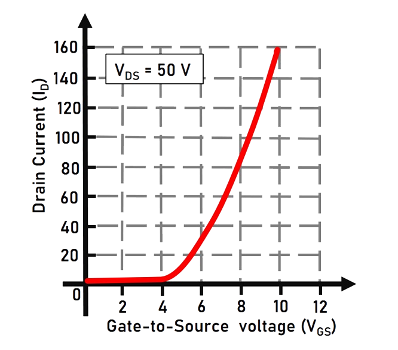
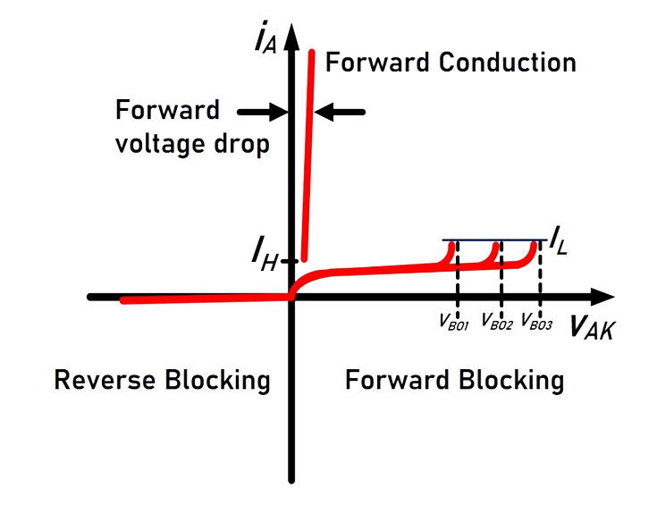
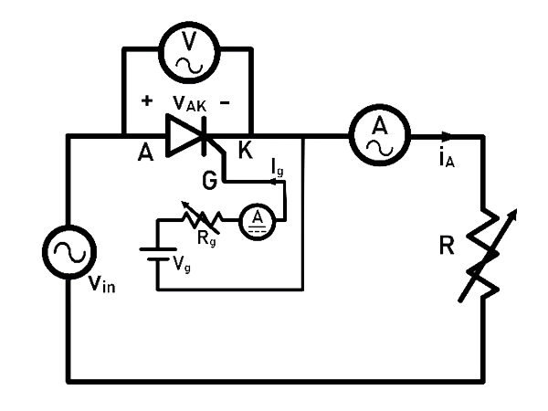

### Theory

**Representation of SCR:**

Fig. 1(a) and 1(b) show the symbolic representation of SCR and a typical SCR package available in market.

 

<table border="0" align="center" style="width:100%; border:none;">
  <tr>
<td style="width:50%">

 

  
Fig. 1(a). Symbolic representation of SCR.
  

</td>
<td style="width:50%">
  

 

  
Fig. 1(b). A typical SCR package.
  

 
    </td>
  </tr>
</table>
 

 

 
  
**Introduction to SCR:**

Fig. 2 shows the internal structure of a SCR. Some of the key features of SCR are compiled and given below.

 
Fig. 2. Internal structure of SCR.
 

 

1.	Silicon-controlled rectifier (SCR) is a semiconductor power device. It is used as a controlled switch in power electronic circuits as bistable switches (ON/ OFF State). In utility dc transmission line applications, series-connected SCRs are employed in It finds wide applications in AC-DC rectifiers, Choppers, AC Voltage controllers, Cycloconverters and Inverters. 

2.	It has a four layer PNPN structure: Two P-type doped (p) layers, Two N-type doped layers, one is heavy doped (n+) and lightly doped (n-). It has three junctions: p-n (J1), n-p (J2) and p-n+ (J3). 
3.	The  SCR has three external terminals namely: Anode (A), Cathode (K) and Gate (G).   

**Operating modes of SCR:**
 

1.	Forward Blocking State: When the anode voltage is made more positive with respect to the cathode and the Gate current is zero, the junctions ‘J1 ‘ and ‘J3 ‘ are forward biased while ‘J2 ‘ is reverse biased. Only a small leakage current flows from anode to cathode. The SCR is then said to be in the forward blocking.

2.	Forward Conducting State: If the anode-to-cathode voltage (vAK)  is increased to a sufficient value, the reverse-biased junction J2 breaks down. This is known as avalanche breakdown. All three junctions (J1, J2 and J3 ) are now forward biased, resulting in flow of current (iA). The device is now in conducting state, or ON-state. A minimum anode current known as ‘latching current’ (IL) needs to be maintained immediately after the SCR goes to ON- State .
  
3.	Once the SCR starts conducting, gate loses control over the device. It continues conducting even after gate signal is removed. However, if the forward anode current (IA) is reduced below a level known as the ‘holding current’ (IH), the SCR goes to blocking state. The holding current is less than the latching current.

4.	Reverse Blocking State:  When the cathode voltage is more positive with respect to the anode, the junctions ‘J1 ‘ and ‘J3 ‘ are reverse biased while junction ‘J2 ‘ is forward biased. No current flows from anode-to-cathode and hence the SCR is in reverse blocking state or OFF- State.  

**'v-i' Characteristics of the SCR:**

1.	‘v-i ‘ characteristics of a SCR shows the variation between the anode current (iA) against the anode-to-cathode voltage (vAK).  
2.	The circuit diagram to plot the characteristics is given in Fig. 3. 

 
Fig. 3. Circuit to plot v-I characteristics.
 

  

3.	The ‘v-i’ characteristics of SCR is shown in Fig. 4.

 
Fig. 4. v-i  characteristics of SCR.
 

  

4.	SCR has three operating modes: Forward Blocking, Forward Conduction and Reverse Blocking as shown in Fig. 4. ‘IH‘ is the holding current and ‘IL‘ is the latching current. The Forward breakover voltages ‘VBO1 , VBO2 and VBO3’ (VBO1 <VBO2 <VBO3 ) correspond to the Gate currents ‘Ig1 , Ig2  and Ig3‘  (Ig1 > Ig2 > Ig3) respectively.

 
  
**Circuit Diagram to plot 'v-i' Characteristics**

The v-i characteristics of SCR can be obtained using the circuit diagram given in Fig. 3. AC supply is connected in series with SCR and a resistive load. In order to obtain the v-i characteristics, the Anode-to-Cathode voltage (vAK) and Anode current (iA) are to be recorded using any one of the following methods:

1.	Using Analog measuring instruments: Voltmeters and Ammeters
2.	Using Digital Storage Oscilloscope

**•	Method-1: Using Analog measuring instruments: Voltmeters and Ammeters**

 
Fig. 5. Circuit Diagram using meters.
 

 

Steps for experimentation (Refer Fig. 5): 

  1.	Ammeter to measure the anode current and Voltmeter to measure the anode-to-cathode voltage (vAK) are to be connected in series and parallel respectively to the SCR.

  2.	The gate supply circuit consists of a battery in series with the  rheostat and an Ammeter. The rheostat (Rg) limits the gate current (Ig) magnitude since only a very small amount of gate current is required to trigger the SCR into ON-state.

  3.	The input supply voltage is increased in steps and the corresponding Voltmeter and Ammeter readings are to be tabulated. The data points indicate the v-i characteristics.  

**Instruments required for the above method:**

<table border="0" align="center" style="width:100%; border:none;">
  <tr>
<td style="width:50%">

  
**Instrument**

</td>
<td style="width:50%">
  

  
**Quantity**

 
    </td>
  </tr>

  <tr>
<td style="width:50%">

  
SCR mounted on a heat sink

</td>
<td style="width:50%">
  
**1** 
    </td>
  </tr>

  <tr>
<td style="width:50%">

Variable AC supply (autotransformer)

</td>
<td style="width:50%">
  

  
**1**

 
    </td>
  </tr>

  <tr>
<td style="width:50%">

Rheostats (Rating: 1 KΩ, 100 KΩ)

</td>
<td style="width:50%">
  

  
**2**

 
    </td>
  </tr>
  
  <tr>
<td style="width:50%">

Multi-meter

</td>
<td style="width:50%">
  

  
**1**

 
    </td>
  </tr>
  
  <tr>
<td style="width:50%">

AC- Voltmeter

</td>
<td style="width:50%">
  

  
**1**

 
    </td>
  </tr>
  
  <tr>
<td style="width:50%">

AC-Ammeter

</td>
<td style="width:50%">
  

  
**1**

 
    </td>
  </tr>
  
  <tr>
<td style="width:50%">

DC-Ammeter

</td>
<td style="width:50%">
  

  
**1**

 
    </td>
  </tr>
</table>

