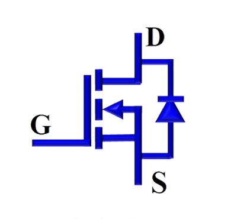

### Theory

**Representation of MOSFET:**

Fig. 1(a) and 1(b) show the symbolic representation of MOSFET and a typical MOSFET package available in market.

 

<table border="0" align="center" style="width:100%; border:none;">
  <tr>
<td style="width:50%">

 

  
Fig. 1(a). Symbolic representation of MOSFET
  

</td>
<td style="width:50%">
  

 

  
Fig. 1(b). A typical MOSFET package
  

 
    </td>
  </tr>
</table>
 

 

 
  
**Introduction to MOSFET:**

Fig. 2 shows the internal structure of MOSFET. Some of the key features of MOSFET are compiled and given below.

 
Fig. 2. Internal structure of MOSFET.
 

 

1.	It is a three-terminal majority carrier device. It exhibits high switching speed, low rise and fall time. It is suitable for low-power, high-frequency switching applications such as DC-DC converters. 

2.	It is a voltage-controlled device and the ‘Gate circuit’ requires only a small amount of current for it to start conducting (ON-State). 

3.	There are two types of MOSFETs: a) Depletion type, b) Enhancement type. Both have three terminals: Drain (D), Source (S) and Gate (G). 

4.  Enhancement-type MOSFET works in two modes: ON-state (conducting) and OFF-state (blocking), controlled by the PWM signal given to the Gate terminal. 

5.  For gate-to-source voltage more than threshold (VT), Enhancement-type MOSFET conducts. At zero gate voltage, it remains in OFF-state. Hence, it is generally used as switching device in  power converters/ power conversion applications. 	  

**Operating modes of MOSFET switching device:**
 

1.	Forward Blocking State (vDS > 0, vGS = 0): A MOSFET is a voltage controlled device. When Drain-to-Source voltage (vDS ) is positive, both the junctions remain reverse biased. MOSFET doesn’t conduct.

2.	Forward Conducting State (vDS > 0, vGS ≥ VT ): When Drain-to-Source voltage (vDS ) is positive, with Gate-to-Source voltage (vGS) more than threshold voltage, the MOSFET starts conducting and hence current flows from drain to source. 
During forward conduction, the MOSFET will operate in any one of the following states, depending on the values of drain-to-source voltage (VDS) and the Gate voltage (VGS) values: Cut-off region, linear region and Saturation region.1
  
3.	Reverse Blocking State (vDS < 0):  When the drain-to-source voltage (VDS) is negative the junctions become reverse biased and MOSFET stops conducting.  

**Characteristics of the MOSFET:**

There are two important characteristics defined for an MOSFET:

1.	Output Characteristics: It is the plot between the Drain-to-Source voltage (VDS) and the Drain current (ID) for a fixed Gate-to-Source voltage (VGS). The circuit diagram to plot these characteristics is given in Fig. 3. Voltage ‘VDS’ is measured by the voltmeter while the ammeter measures the current ‘ID’.  

 
Fig. 3. Circuit diagram for output characteristics.
 

  

The output characteristics of MOSFET is shown in Fig. 4.

 
Fig. 4. Output characteristics of MOSFET.
 

  

MOSFET has three operating regions: Cutoff region, Linear region and Saturation region as shown in Fig. 4.

2.	Transfer Characteristics: It is the plot between the Gate-to-Source voltage (VGS) and the Drain current (ID) for a fixed value of Drain-to-Source voltage (VDS). The circuit diagram to plot the characteristics is given in Fig. 5. Voltage ‘VGS‘ is measured by the voltmeter while the ammeter measures the current ‘ID’. 

3.	Switching characteristics: It is drain current and drain-to-source voltage profiles when they are turned- ON-to-OFF and OFF-to-ON (during transition). 

 
Fig. 5. Circuit diagram for Transfer characteristics.
 

  

 

The Transfer characteristics of MOSFET is shown in Fig. 6.

 
Fig. 6. Transfer characteristics of MOSFET.
 

 
